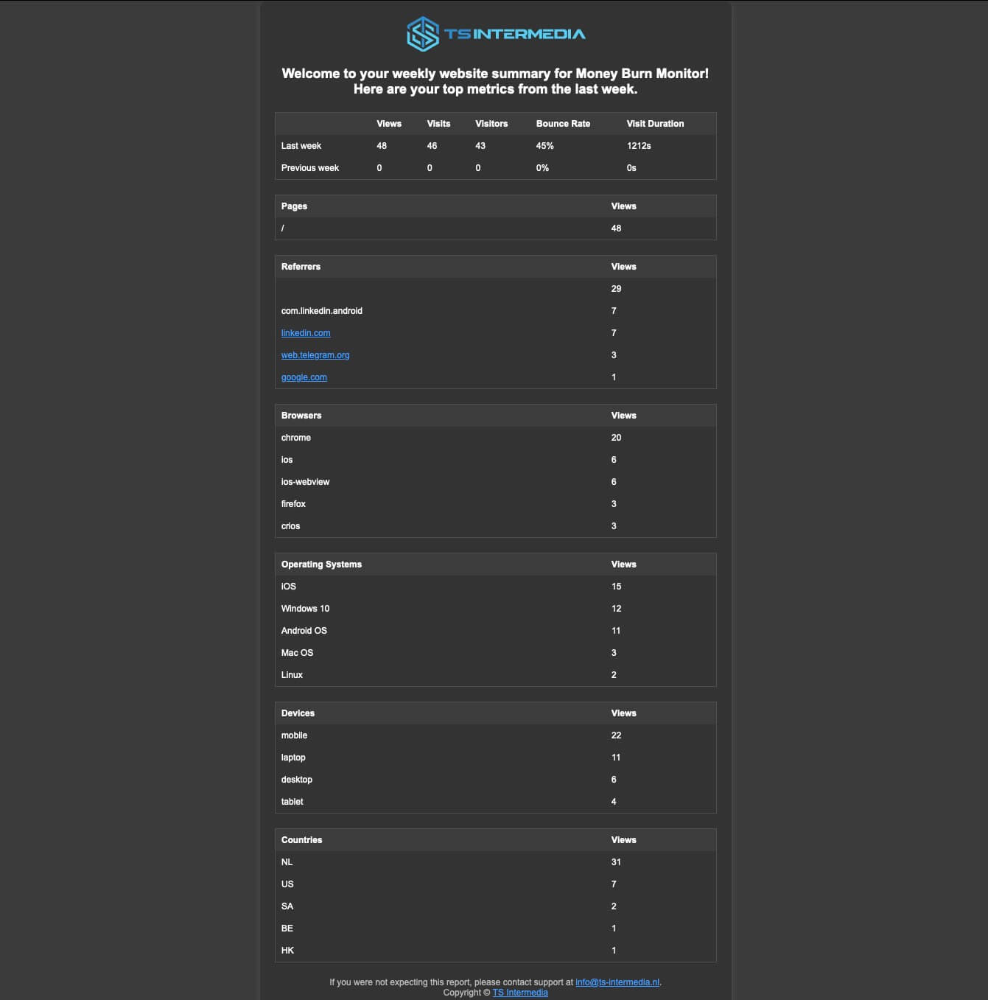

# Self hosted Umami analytics eMail reports python script

## 🌟 Overview

**Umami Email Reports** is a 🐍 Python script designed for self-hosted 🌐 Umami environments. While the 💰 paid Pro version of Umami includes 📧 email reports, this script replicates much of that functionality, allowing you to send 📊 analytics summaries via email for 🆓. If you're hosting your own Umami analytics, this script is a great way to generate and email reports for 📅 weekly, 📆 monthly, 🕓 quarterly, or 🗓️ yearly analytics.

This script is highly customizable and lets you style emails with a dedicated 🎨 `style.css` file. It’s perfect for 👨‍💻 developers who want more control over their analytics setup.



---

## 🤔 Why I built this

The self-hosted version of Umami lacks built-in email reporting, a feature available only in the 💰 paid Pro version. Since I wanted to host 🌐 Umami on my own server and still receive 📧 analytics reports via email, I created this script. While it’s still evolving and doesn’t include all the features of Umami’s Pro Email Reports, it’s a close approximation that you can run daily using a 🕒 cron job.

---

## 🛠️ How this can help you

- **📈 Automated Reporting**: Schedule 🕒 daily cron jobs to generate and email analytics reports.
- **💵 Cost-Effective**: Avoid upgrading to the Pro version of 🌐 Umami.
- **🎨 Customization**: Edit the `style.css` file to personalize the email design.
- **🔍 Analytics Insights**: Share detailed 📊 analytics summaries (e.g., views, visits, referrers) with multiple recipients.

---

## ✨ Features

- Supports 📅 weekly, 📆 monthly, 🕓 quarterly, and 🗓️ yearly analytics.
- Includes stats like 👀 views, 🚶‍♂️ visits, 👥 visitors, ↩️ bounce rate, and ⏳ session duration.
- Provides details on 🌐 URLs, ↩️ referrers, 🌍 browsers, 🖥️ operating systems, 📱 devices, 🗺️ countries, and 🖱️ events.
- Configurable for multiple 🌐 websites and recipients.
- Customizable 📧 email styling via `style.css`.

---

### **🌍 Supported Languages Section for README.md**

The Umami Email Reports script supports a wide range of languages to make the reports accessible to as many users as possible. Below is the list of currently available languages:

- **Dutch (Nederlands) – `nl.json`** *(Native Speaker)*
- **English – `en.json`**
- **German (Deutsch) – `de.json`**
- **Italian (Italiano) – `it.json`**
- **Spanish (Español) – `es.json`**
- **French (Français) – `fr.json`**
- **Portuguese (Português) – `pt.json`**
- **Swedish (Svenska) – `sv.json`**
- **Danish (Dansk) – `da.json`**
- **Estonian (Eesti) – `et.json`**
- **Finnish (Suomi) – `fi.json`**
- **Icelandic (Íslenska) – `is.json`**
- **Latvian (Latviešu) – `lv.json`**
- **Lithuanian (Lietuvių) – `lt.json`**
- **Norwegian (Norsk) – `no.json`**
- **Czech (Čeština) – `cs.json` / `cz.json`**
- **Polish (Polski) – `pl.json`**
- **Slovak (Slovenčina) – `sk.json`**
- **Hungarian (Magyar) – `hu.json`**
- **Romanian (Română) – `ro.json`**
- **Bulgarian (Български) – `bg.json`**
- **Serbian (Српски) – `rs.json`**
- **Slovenian (Slovenščina) – `si.json`**
- **Croatian (Hrvatski) – `hr.json`**
- **Ukrainian (Українська) – `ua.json`**
- **Georgian (ქართული) – `ge.json`**
- **Sample Placeholder – `sample.json`**

---

### **🌟 A Note About Translations**

I am a native Dutch speaker, and I can confidently say that the Dutch, English, and German translations have been manually reviewed. For the remaining languages, I’ve used AI-generated translations to speed up the process and broaden the tool's reach.

If you spot any mistakes or inconsistencies in the translations for your language, I’d greatly appreciate your help! Feel free to submit a **GitHub Issue** or, even better, a **Pull Request** with improvements to the respective language file. Your contributions help make this tool even better for everyone! 😊

---

## 🖥️ Prerequisites

### 📚 Required libraries

- `requests`
- `smtplib`
- `email`
- `MIME`
- `datetime`

Install dependencies via:

Using **pixi**:

```bash
pixi run report
```

Using **pip**:

```bash
pip install -r requirements.txt
python umami_report.py
```

### 🐍 Python version

- Requires Python 3.8 or higher.

---

## 🛠️ Installation

1. Clone the repository:

   ```bash
   git clone git@github.com:tvdsluijs/umami-self-hosted-email-reports.git
   cd umami-email-reports
   ```

2. Install dependencies using `pixi` or `pip` as described above.

3. Set up `config.json` and `websites_config.json` in the root directory.

   - Sample configuration files are included for reference.

---

## 🗂️ Configuration files

### `config.json`

Defines your 🌐 Umami API credentials, SMTP settings, and company details.

```json
{
    "umami": {
        "api_url": "https://your-umami-url/api/websites",
        "username": "your-username",
        "password": "your-password"
    },
    "company": {
        "name": "Umbrella Corporation",
        "url": "https://example.com",
        "email": "info@example.com",
        "logo": "https://your-logo-url.jpg"
    },
    "smtp": {
        "host": "smtp.example.com",
        "port": 587,
        "username": "your-email@example.com",
        "password": "your-email-password",
        "from_email": "your-email@example.com",
        "from_name": "Website Report"
    }
}
```

### `websites_config.json`

Defines the 🌐 websites, their reporting frequency, recipients, and metrics to include.

```json
[
    {
        "website_id": "website-id-1",
        "name": "website 1 name",
        "frequency": "week",
        "lang": "en",
        "send_day": [],
        "top": 10,
        "emails": ["recipient1@example.com", "recipient2@example.com"],
        "what_stats": ["stats", "events", "urls", "referrers", "browsers", "oses", "devices", "countries"]
    },
    {
        "website_id": "website-id-2",
        "name": "Website 2 name",
        "frequency": "month",
        "lang": "nl",
        "send_day": [],
        "top": 5,
        "emails": ["recipient3@example.com"],
        "what_stats": ["stats", "events", "urls", "referrers", "browsers", "oses", "devices", "countries"]
    },
    {
        "website_id": "website-id-3",
        "name": "website 3 name",
        "frequency": "day",
        "lang": "de",
        "send_day": ["mon", "thu"],
        "emails": ["recipient1@example.com", "recipient2@example.com"],
        "what_stats": ["stats", "events", "urls"]
    }
]
```

### Frequencies

The `frequency` field in `websites_config.json` determines how often reports are sent:

- `day`: Sends daily reports, every day or on the specified `send_day`.
- `week`: Sends weekly reports on the specified `send_day`.
- `month`: Sends reports on the first day of each month.
- `quarter`: Sends reports on the first day of each quarter (January, April, July, October).
- `year`: Sends reports on the first day of the year (January 1st).

---

## 🚀 Usage

1. **Run the Script**

   Using **pixi**:

   ```bash
   pixi run report
   ```

   Using **pip**:

   ```bash
   python umami_report.py
   ```

2. **Set Up a Cron Job**
   Schedule the script to run daily for consistent 📅 weekly, 📆 monthly, 🕓 quarterly, and 🗓️ yearly reports at 7AM.

  Run with Pixi
  ```bash
  0 7 * * * cd /path/to/your/project && pixi run report
  ```

  Run with pip / python
   Example crontab entry:

   ```bash
   0 7 * * * /path/to/your/virtualenv/bin/python /path/to/your/project/umami_report.py
   ```
---

## 🎨 Customization

### 📧 Email Styling

Modify the `style.css` file in the root directory to adjust the look and feel of the email. Example styles include fonts, colors, table layouts, and spacing.

---

## 🐋 Running Alongside Umami Docker Environment

You can run this script directly alongside your 🌐 Umami Docker setup. Ensure your `config.json` points to your 🌐 Umami API URL and includes valid credentials.

---

## 🛠️ Troubleshooting

### ⚠️ Common Errors

1. **CSS File Not Found**:
   Ensure `style.css` exists in the root directory. If missing, the script will fall back to default styling.

2. **Authentication Issues**:
   Double-check the `username` and `password` in `config.json` and verify they match your 🌐 Umami credentials.

3. **SMTP Errors**:
   Verify SMTP settings in `config.json` and test the connection using tools like Telnet to confirm the server is accessible.

4. **Missing Data in Emails**:
   Ensure the correct `website_id` and metrics are specified in `websites_config.json`.

### 🤔 Need Help?

- Submit an issue in the [GitHub repository](https://github.com/your-repo/umami-email-reports/issues).
- Contact me directly at [info@your-email.com](mailto\:info@your-email.com).

---

## 📝 License

This project is licensed under the MIT License. See the `LICENSE` file for details.

---

## ✍️ Author

**Theo van der Sluijs**

- [GitHub](https://github.com/tvdsluijs)
- [📧 Email](mailto\:theo@vandersluijs.nl)
- [🌐 Website](https://itheo.tech)

---

## 💖 Sponsoring

If you find this project helpful and would like to support its development, consider sponsoring me:

- [GitHub Sponsors](https://github.com/sponsors/tvdsluijs)
- [Buy Me a Coffee](https://buymeacoffee.com/itheo)

Your support helps me maintain and improve this project. Thank you! 🙏
